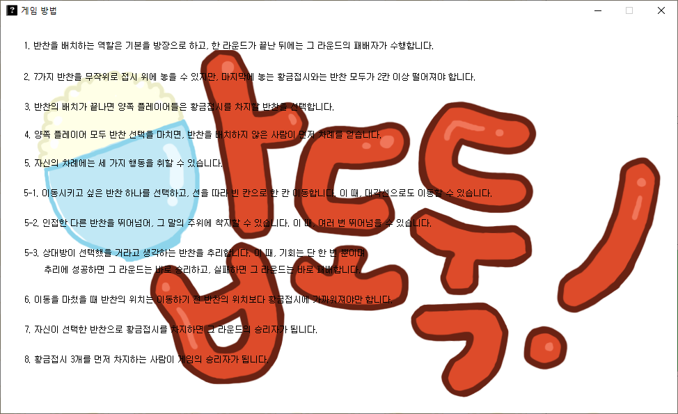
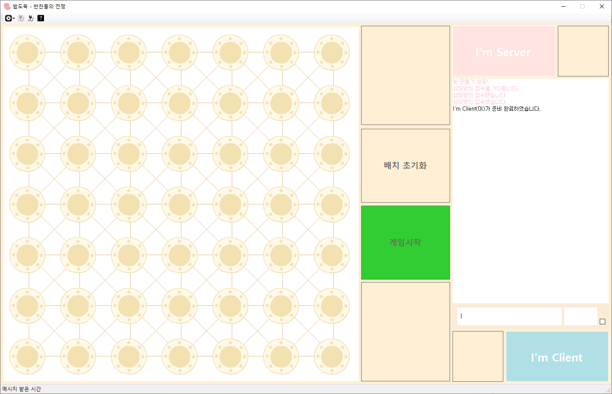

# 밥도둑! 반찬들의 전쟁
보드게임 Der Isses! 의 규칙을 적용해서 만든 1:1 네트워크 보드게임입니다.

## 프로젝트 개요

### 개발 기간
2017.06 ~ 2017.09

### 개발 언어
C#

### 개발 인원
1명

### 플레이 방법
- 먼저 서버 역할을 할 컴퓨터에서 프로그램을 실행하고, 서버를 체크한 뒤 닉네임과 포트번호를 입력합니다.   
   

- 왼쪽 위 빨간 사각형으로 표시된 연결 버튼을 클릭하면 클라이언트의 연결을 기다립니다.   
    

- 다음은 클라이언트 역할을 할 컴퓨터에서 프로그램을 실행하고, 서버 IP, 닉네임, 포트번호를 입력합니다.   
   

- 왼쪽 위 빨간 사각형으로 표시된 연결 버튼을 클릭하면 실행 중인 서버에 연결합니다.  
   

- 이제 규칙에 따라 게임을 진행할 수 있습니다. 규칙은 메뉴 4번째 버튼을 누르면 표시됩니다.  
   

- 클라이언트가 준비완료를 누르면 서버에서 게임을 시작할 수 있습니다.  
   

- 서버가 게임 시작 버튼을 누르면 게임이 시작됩니다.  
   

- 게임을 시작하면 서버는 먼저 말 배치를 합니다.  
   

- 배치를 완료하면 서로 황금 접시를 획득할 말을 선택합니다.  
   

- 규칙에 따라 게임을 진행하고 승패가 결정됩니다.  
   